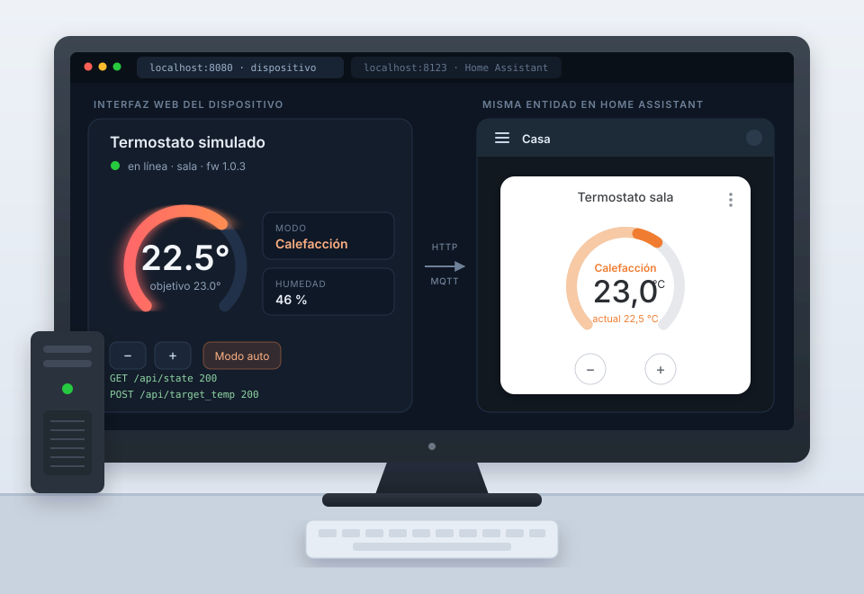

# Prueba técnica — Dispositivo IoT simulado con integración a Home Assistant

## Objetivo

Construir la simulación de un dispositivo IoT que corra localmente, exponga su propio servidor web y pueda ser controlado y monitoreado desde Home Assistant.

La prueba evalúa criterio técnico: el diseño del dispositivo, de su API y de la integración es parte de lo que se está calificando, por lo que las decisiones quedan en tus manos.

## Requerimientos

1. **Simulación del dispositivo**

   Un proceso que se ejecute en tu computadora y se comporte como un dispositivo IoT real: mantiene un estado interno, lo actualiza con el tiempo y responde a comandos. El tipo de dispositivo lo eliges tú (por ejemplo un termostato, un foco, un sensor ambiental, una cerradura, etc.).

   

   *Referencia ilustrativa: un termostato simulado corriendo en una máquina de escritorio, con su propia interfaz web (izquierda) y la misma entidad controlable desde Home Assistant (derecha). Es un ejemplo del tipo de resultado esperado, no un diseño a replicar ni una elección de dispositivo obligatoria.*

2. **Servidor web propio**

   El dispositivo debe levantar su propio servidor web y exponer una interfaz para consultar su estado y operarlo. Piensa en cómo lo haría un dispositivo comercial que vive en la red local.

3. **Integración con Home Assistant**

   El dispositivo debe aparecer en Home Assistant como una o más entidades, reflejar su estado en tiempo razonable y poder controlarse desde la interfaz de Home Assistant. Existe más de un camino válido para lograrlo; elige uno y justifica por qué.

## Entregables

- El código fuente del dispositivo simulado y de la integración.
- Instrucciones para levantar todo desde cero (dependencias, comandos, configuración de Home Assistant).
- Un documento breve donde expliques tu arquitectura, las decisiones de diseño que tomaste y los trade-offs que consideraste.
- Evidencia de que funciona: capturas o un video corto del dispositivo operando desde Home Assistant.

## Entrega

La entrega se hace en un **fork privado** de este repositorio, no por Pull Request: así el trabajo de cada participante queda aislado y nadie puede ver las soluciones de los demás.

Para entregar tu solución:

1. Crea un fork privado de este repositorio en tu cuenta.
2. Trabaja y haz tus commits ahí; puedes usar `main` o las ramas que prefieras.
3. Da acceso de lectura a los evaluadores y avísanos cuando consideres que está terminado.

Solo se evaluará el contenido de tu fork, así que asegúrate de que todo lo que quieres mostrar esté ahí. El historial de commits también se revisa: commits pequeños y con mensajes claros cuentan a favor.

## Consideraciones

- Puedes usar el lenguaje, framework y herramientas que prefieras.
- Puedes correr Home Assistant como prefieras (Docker, entorno virtual, instalación nativa).
- El uso de librerías y de herramientas de IA está permitido; se espera que puedas explicar y defender cada parte del código que entregues.
- Si algo del enunciado te parece ambiguo, documenta el supuesto que tomaste y continúa.

## Qué se evalúa

- Que funcione de extremo a extremo y sea fácil de levantar siguiendo tus instrucciones.
- La calidad del diseño: separación de responsabilidades, manejo de errores y de estado, claridad del código.
- El realismo de la simulación y de la integración frente a cómo se comporta un dispositivo real.
- La experiencia de uso en los dos frentes: para el usuario final que opera el dispositivo (interfaz clara, estados comprensibles, respuesta inmediata a sus acciones) y para el usuario integrador que consume tu API o instala la integración (contratos predecibles, errores informativos, documentación suficiente para arrancar sin preguntar).
- La claridad con la que comunicas y justificas tus decisiones.

## Tiempo y alcance

El tiempo sugerido de entrega es de 1 a 2 semanas. No es una fecha límite rígida: trabaja al ritmo que necesites y avísanos cuando consideres que el proyecto está terminado.

Dicho eso, preferimos un alcance acotado y bien resuelto sobre uno amplio e incompleto; si dejas cosas fuera, anótalas como trabajo pendiente.
